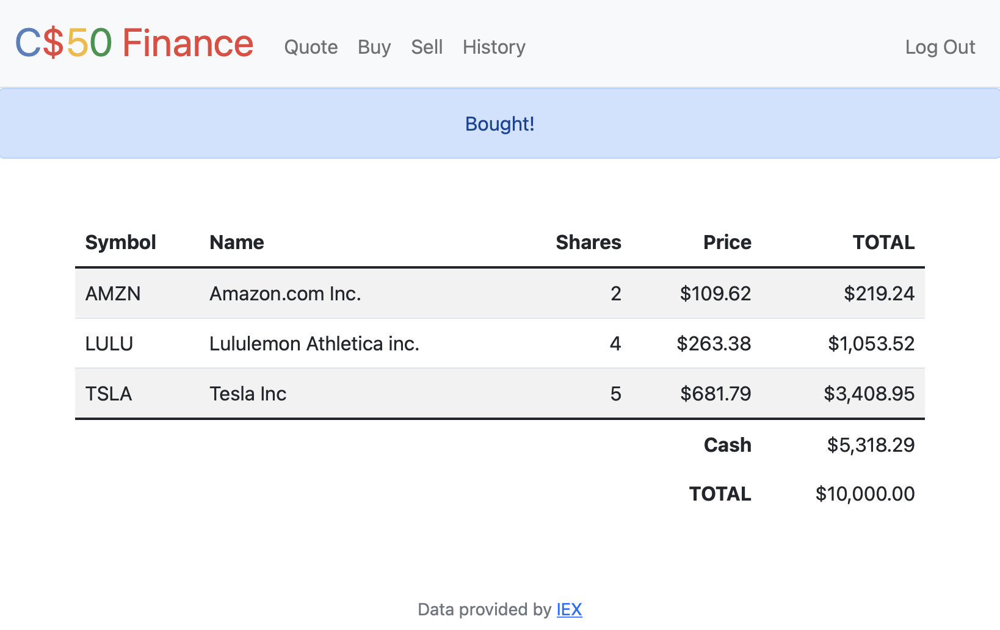

# Finance: A Stock Portfolio

Project for Week 8 of Harvard's CS50

[View the full assignment description on CS50's OpenCourseWare](https://cs50.harvard.edu/x/2020/tracks/web/finance/)

## Technologies
* Python
* Flask with session authentication
* SQL
* HTML
* Bootstrap

## Summary
Finance is a web app that allows logged-in users to "buy" and "sell" stocks (with pretend money) as well as look up real stock quotes fetched from IEX API. Users can also view their stock portfolio transaction history.

## How to Run
1. Clone this repository, navigate to the project and type the following commands:
2. Activate a virtual environment: 'python3 -m venv .venv' then select the virtual environment as the active workspace
3. Install dependencies: 'pip install -r requirements.txt'
4. Run command 'export FLASK_APP=application.py' to set the Flask environment variable
5. <a href="https://cs50.harvard.edu/x/2020/tracks/web/finance/#configuring">Configure and export your API key with these instructions</a>
6. Run command 'flask run' to open on localhost 
7. When the finance site opens in your browser, register for a new account (upper right corner) to create your own stock portfolio

## Views

### Register
Allow a new user to register for an account, rendering an apology view if the form data is incomplete or if the username already exists in the database.

### Index
The homepage displays a table of the logged-in user's owned stocks, number of shares, current stock price, value of each holding. This view also shows the user's imaginary "cash" balance and the total of their "cash" plus stock value.

### Quote
Allows the user to submit a form to look up a stock's current price, retrieving real-time data from the IEX API. An error message is rendered if the stock symbol is invalid.

### Buy
Allows the user to "buy" stocks by submitting a form with the stock's symbol and number of shares. Checks to ensure the stock symbol is valid and the user can afford the purchase at the stock's current market price with their available balance, and stores the transaction history in the database.

### Sell
Allows the user to "sell" shares of any stock currently owned in their portfolio. 

### History
Displays a table summarizing the user's past transactions (all buys and sells). Each row in the table lists whether the stock was bought or sold, the stock's symbol, the buy/sell price, the number of shares, and the transaction's date/time.

---

Please note that the **Login** and **Logout** functions and all functions in **helpers.py** came with the assignment starter code and are not my work. Starter code &copy;2020 David J. Malan/ Harvard
